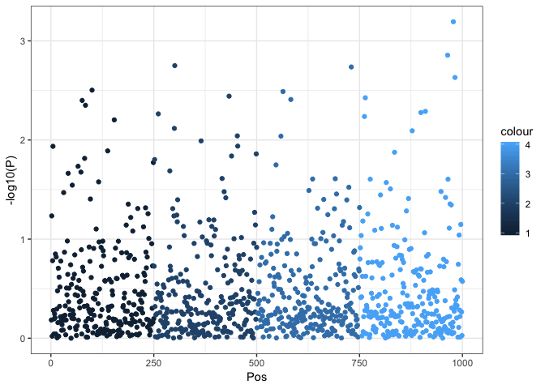
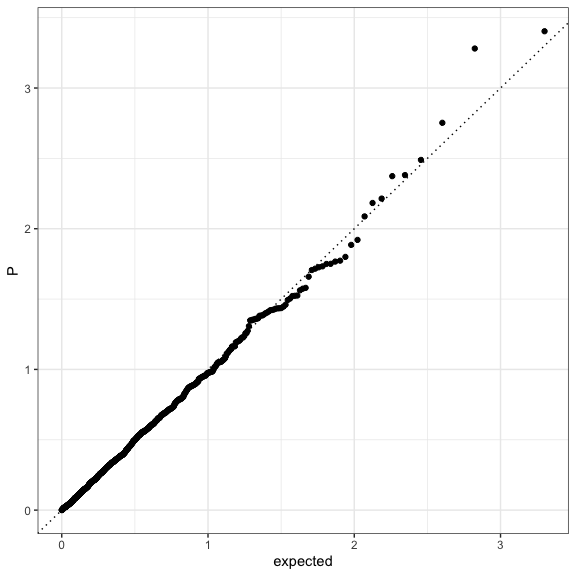

<!-- README.md is generated from README.Rmd. Please edit that file -->

# ggGWAS 🚧

<!-- badges: start -->

[](https://travis-ci.org/sinarueeger/ggGWAS)
[](https://codecov.io/gh/sinarueeger/ggGWAS?branch=master)
<!-- badges: end -->

An R-Package (*work-in-progress*) that contains ggplot2-extensions of
data visualisations used with GWAS data.

Mainly, these are Q-Q plot and Manhattan plot that both use P-values
from GWASs as input.

An inspiration for ggGWAS has been the R-package
[qqman](http://www.gettinggeneticsdone.com/2014/05/qqman-r-package-for-qq-and-manhattan-plots-for-gwas-results.html),
except that ggGWAS aims to have the look and functionality of `ggplot2`.

## Installation

You can install the development version from
[GitHub](https://github.com/) with:

``` r
# install.packages("remotes")
remotes::install_github("sinarueeger/ggGWAS")
```

Install the `dev`branch:

``` r
remotes::install_github("sinarueeger/ggGWAS", ref = "dev")
```

Install including vignettes:

``` r
remotes::install_github("sinarueeger/ggGWAS", build = TRUE, build_opts = c("--no-resave-data", "--no-manual"))
vignette("gggwas-reasoning")
vignette("gggwas-internals")
```

## Basic usage

``` r
library(ggGWAS)
library(ggplot2)

theme_set(theme_bw())
## Generate some random data

df <-
  data.frame(
    POS = rep(1:250, 4),
    CHR = 1:4,
    P = runif(1000),
    GWAS = sample(c("a", "b"), 1000, replace = TRUE)
  )
```

### Manhattan plot

``` r
ggplot(data = df) + stat_gwas_manhattan(aes(pos = POS, y = -log10(P), chr = CHR))
```



``` r

?stat_gwas_manhattan ## for more examples
```

### Q-Q plot

Lightweight Q-Q plot (with hex tiles)

``` r

ggplot(data = df) + stat_gwas_qq_hex(aes(y = P))
```


``` r

?stat_gwas_qq_hex ## for more examples
```

Conventional Q-Q plot

``` r
ggplot(data = df) + stat_gwas_qq(aes(observed = P))
```



``` r

?stat_gwas_qq ## for more examples
```
