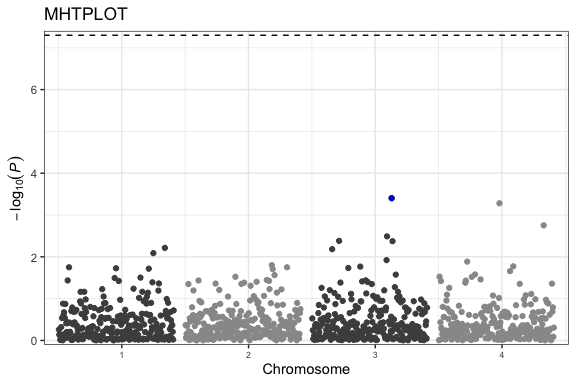

<!-- README.md is generated from README.Rmd. Please edit that file -->

# ggGWAS

<!-- badges: start -->

[](https://travis-ci.org/sinarueeger/ggGWAS)
[](https://codecov.io/gh/sinarueeger/ggGWAS?branch=master)
<!-- badges: end -->

An R-Package (*work-in-progress*) that contains ggplot2-extensions of
data visualisations used with GWAS data.

Mainly, these are Q-Q plot and Manhattan plot that both use P-values
from GWASs as input.

An inspiration for ggGWAS has been the R-package
[qqman](http://www.gettinggeneticsdone.com/2014/05/qqman-r-package-for-qq-and-manhattan-plots-for-gwas-results.html),
except that ggGWAS aims to have the look and functionality of `ggplot2`.

## Installation

You can install the development version from
[GitHub](https://github.com/) with:

``` r
# install.packages("remotes")
remotes::install_github("sinarueeger/ggGWAS")
```

Install including vignettes:

``` r
remotes::install_github("sinarueeger/ggGWAS", build = TRUE, build_opts = c("--no-resave-data", "--no-manual"))
vignette("gggwas-reasoning")
vignette("gggwas-internals")
```

Install the `dev` branch:

``` r
remotes::install_github("sinarueeger/ggGWAS", ref = "dev")
```


## Basic usage

``` r
library(ggGWAS)
library(ggplot2)
#> Warning: package 'ggplot2' was built under R version 3.5.2

theme_set(theme_bw())
## Generate some random data
n <- 1000
n_chr <- 4

df <-
  data.frame(
    POS = rep(1:(n/n_chr), n_chr),
    CHR = rep(1:n_chr, rep(n/n_chr, n_chr)),
    SNP = paste0("rs", 1:n),
    P = runif(n),
    GWAS = sample(c("a", "b"), n, replace = TRUE)
  )
```

### Q-Q plot

Lightweight Q-Q plot (with hex tiles)

``` r
library(ggGWAS)
ggplot(data = df) + 
  stat_gwas_qq_hex(aes(y = P)) + 
  geom_abline(intercept = 0, slope = 1, linetype = 3)
```


``` r

?stat_gwas_qq_hex ## for more examples
```

Conventional Q-Q plot

``` r
ggplot(data = df) +
  stat_gwas_qq(aes(y = P)) + 
  geom_abline(intercept = 0, slope = 1, linetype = 3)
```


``` r

?stat_gwas_qq ## for more examples
```

### Manhattan plot

Currently working on `stat_gwas_manhattan()` that should at one point
look like this:

    ggplot(data = df) + stat_gwas_manhattan(aes(pos = POS, y = -log10(P), chr = CHR))

Till then, use the `ggman::ggmanhattan` function from the [`ggman`](https://github.com/mkanai/ggman) package:

``` r
library(dplyr)
library(ggman)
ggman::ggmanhattan(data = df, SNP = "SNP", chr = "CHR", bp = "POS", P = "P", sparsify = FALSE, theme_base = theme_bw(), build = 'hg18', highlight = df %>% slice(which.min(P)) %>% pull(SNP)) +
  labs(title = "MHTPLOT" )
```



\#\#Contributing lease note that the ‘ggGWAS’ project is released with a
[Contributor Code of Conduct](CODE_OF_CONDUCT.md). By contributing to
this project, you agree to abide by its terms.
