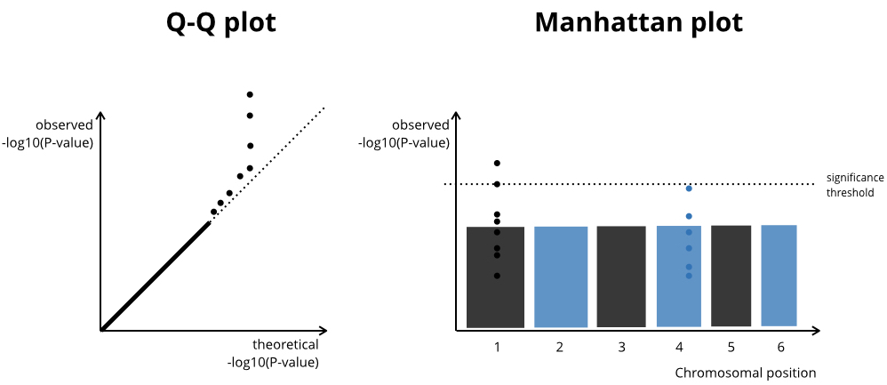

<!----
output:
  md_document:
    preserve_yaml: true
------>

# Summary

Genome-wide association studies (GWAS) estimate the association between
each genetic variant available (e.g. single nucleotide variant (SNV)) and a trait of interest. The output of a GWAS is
a matrix that contains the information and summary statistic for each
genetic variant per line. The columns are somewhat arbitrarily names, but often
include
`SNP identifier, chromosome, position, effect size, standard error, p-value effect allele, minor allele frequency`.

GWAS summary statistics are often computed for > 1 Mio genetic variants. To summarise such large amounts of data and verify model assumptions two plots are typically inspected:

- A Q-Q plot displays the theoretical against the observed p-values [@mccarthy]. This helps to identify inflated P-values due to a mispecified GWAS model. Genomic inflation factors attempt the same. 
- A Manhattan plot displays the p-values along the chromosomal position [@mccarthy] and aims to show the location of potential hits in the genome. 




While the GWAS computation itself is often done with command line tools (e.g. @plink2 or @gcta), the exploration and validation of the results is done in conventional statistical software, such as R [@rstats].

Q-Q plots are an important tool during the analysis process, but a Manhattan plot can become a primary figure of an article. For example, a recent GWAS in anorexia [@watson] has a Manhattanplot as Figure 1, but the Q-Q plot is in the Supplementary material. Therefore, fast plotting is key to quickly summarise results during the analysis process and take decisions. But equally important is versatile plotting - being able to add layers and annotation to a plot to make it easily understandable and visually appealing for the reader of a manuscript. 

``ggplot2``[@ggplot2] offers such a versatile data visualisation package that is widely used. However, ``ggplot2`` is not optimised for plotting high dimensional data. 

With ``ggGWAS`` we propose a ``ggplot2`` extension for GWAS Q-Q plots (`geom_gwas_qq`) and Manhattan plots (`geom_gwas_manhattan`). For `geom_qqplot` there is additionally a hexagon version that reduces computing time by xx (`geom_gwas_qq_hex`). For both functions there is a filtering argument where points can be excluded from plotting.  


# Background

Q-Q plots and Manhattan plots are implemented in R with various functions. The most widely used package is ``qqman`` [@qqman], that has functions based on base R ``graphics`` (`qq` and `manhattan`). Similarly, the `ramwas` bioconductor package [@ramwas] has two fast plotting functions based on baseR too (`manPlotFast` and `qqPlotFast`). There are many `ggplot2` wrapper, e.g. `mkanai/ggman` [@ggman:kanai], `drveera/ggman` [@ggman:drveera], `ggbio` [@ggbio], but none of these is an extension that inherits the ggplot2 functionalities. 

How can we speed up plotting with ``ggplot2``? With one approach, we can plot a subset of points (called _filtering_ later). Another approach uses _hexagons_ to represent neighbouring points. Hexagons are implemented in R and ``ggplot2`` and have been used by others to plot high dimensional data [@schex]. _Filtering_ reduces the `ggplot2` object size and the rendering speed, while the use of _hexagons_ reduces the rendering speed. 


<!---------
There is a third option which we will call "rastering", but this will only affect the resulting image file size and not really the plotting speed in R.

|           | Obj Size | Plotting speed | File size |
|-----------|----------|----------------|-----------|
| Filtering | x        | x              | x         |
| hexagons    |          | x              | x         |
| raster    |          |                | x         |
-------->

# The `ggGWAS` R package

The `ggGWAS` package depends mainly on ``ggplot2``, ``hexbin``, ``scales``.


# Brief example

Below is a brief example with real exome based summary statistics from the [Genetic Investigation of ANthropometric Traits](https://portals.broadinstitute.org/collaboration/giant/index.php/GIANT_consortium_data_files).
```{r settings, message=FALSE, warning=FALSE, include=FALSE}
library(GWAS.utils)
library(ggplot2)
library(ggGWAS)
library(dplyr)
theme_set(theme_bw())
knitr::opts_chunk$set(warning = FALSE, message = FALSE)

```


## Data


```{r cache = TRUE, echo = FALSE}

## Source: https://portals.broadinstitute.org/collaboration/giant/index.php/GIANT_consortium_data_files
path_to_file_1 <- "~/tmp/Height_AA_add_SV.txt.gz"
path_to_file_2 <- "~/tmp/BMI_African_American.fmt.gzip" 


## Height
download.file(
  "https://portals.broadinstitute.org/collaboration/giant/images/8/80/Height_AA_add_SV.txt.gz",
  path_to_file_1)

## BMI
download.file(
  "https://portals.broadinstitute.org/collaboration/giant/images/3/33/BMI_African_American.fmt.gzip",
  path_to_file_2)
```

```{r echo=TRUE, warning=FALSE}
data <- vroom::vroom(
  c(path_to_file_1, path_to_file_2), id = "path") %>% 
  dplyr::mutate(gwas = 
           dplyr::case_when(path == "~/tmp/BMI_African_American.fmt.gzip"  ~ "BMI-AA",
                     path == "~/tmp/Height_AA_add_SV.txt.gz"  ~ "Height-AA"
                     )
         )

data %>% janitor::tabyl(gwas)
data_height <- data %>% dplyr::filter(gwas == "Height-AA")
data_height[1:3,]
```


## Q-Q plot

For a basic Q-Q plot, we 

```{r qqplot-example, fig.height=6, fig.width=6, out.width="40%"}
ggplot(data = data_height) + 
  geom_gwas_qq(aes(y = Pvalue)) + 
  geom_abline(intercept = 0, slope = 1, linetype = 2) + 
  theme(aspect.ratio = 1) + 
  labs(title = "geom_gwas_qq")
```

```{r qqplot-example-filter, fig.height=6, fig.width=6, out.width="40%"}
ggplot(data = data_height) + 
  geom_gwas_qq(aes(y = Pvalue), y.thresh = 0.1) + 
  geom_abline(intercept = 0, slope = 1, linetype = 2) + 
  theme(aspect.ratio = 1) + 
  xlim(0, NA) + ylim(0, NA) + 
  labs(title = "geom_gwas_qq + FILTER")
```


```{r qqplot-example-hex, fig.height=6, fig.width=6, out.width="40%"}
ggplot(data = data_height) + 
  geom_gwas_qq_hex(aes(y = Pvalue)) + 
  geom_abline(intercept = 0, slope = 1, linetype = 2) + 
  theme(aspect.ratio = 1) + 
  labs(title = "geom_gwas_qq + Hexagons")
```

``geom_gwas_qq_hex`` does not use the default hexagons, but a tweaked version. 

```{r qqplot-example-hex-zoom, fig.height=5, fig.width=10, out.width="80%"}
plot_qq <- ggplot(data = data_height) + 
  geom_gwas_qq(aes(y = Pvalue)) + 
  geom_abline(intercept = 0, slope = 1, linetype = 2) + 
  labs(title = "geom_gwas_qq")

plot_qq_hex <- ggplot(data = data_height) + 
  geom_gwas_qq_hex(aes(y = Pvalue), bins = 100, hex.function = ggplot2:::hexBinSummarise) + 
  geom_abline(intercept = 0, slope = 1, linetype = 2) + 
  labs(title = "geom_gwas_qq + Hexagons")

zoom <- plot_qq + coord_cartesian(ylim = c(0, -log10(0.05)), xlim = c(0, -log10(0.05)))
zoom_hex <- plot_qq_hex + coord_cartesian(ylim = c(0, -log10(0.05)), xlim = c(0, -log10(0.05)))

library(cowplot)
plot_grid(zoom, zoom_hex, ncol = 2)

```

Grouping^[Of course, plotting by Chromosome does not make much sense.]. Note, that the statistics will be computed within each facet or group
```{r qqplot-example-group, fig.width=6, out.width="80%"}
ggplot(data = data_height %>% filter(CHR %in% c(1, 5, 6))) + 
  geom_gwas_qq(aes(y = Pvalue)) + 
  facet_wrap(~CHR, scales = "free_y") + 
  geom_abline(intercept = 0, slope = 1, linetype = 2) + 
  theme(aspect.ratio = 1) + 
  labs(title = "geom_gwas_qq + facet/grouping")
```


Using a combination of ``ggplot2::stat_qq`` and ``ggGWAS::mlog10_trans``. 

```{r qqplot-example-scale, fig.height=6, fig.width=6, out.width="40%"}
ggplot(data = data_height) + 
  stat_qq(aes(sample = Pvalue), distribution = stats::qunif) +
  scale_y_continuous(trans = "mlog10") +
  scale_x_continuous(trans = "mlog10") +
  geom_abline(intercept = 0, slope = 1) + 
  theme(aspect.ratio = 1) + 
  labs(title = "-log10 transformation")

```


## Manhattanplot

`ggplot(data = giant) + geom_gwas_manhattan(aes(pos = POS, chr = CHR, y = -log10(P)))`


- range of chromosomes can be passed on
- allow for the `raster` version (for faster plotting) and Pvalue thresholding (removing the high Pvalue SNPs from the plot)
- implement coloring (two alternating colors)

# Discussion

- even though facetting could work, this is probably not computationally possible (RAM!) when multiple GWAS with millions of SNPs are present. 

- implemented rastering, but that did not work (only dcreased file size)

- speed comparison `qqman::manhattan(giant, chr = "CHR" , bp = "POS", p = "P")`


# Acknowledgements

<!-------- We acknowledge contributions from Brigitta Sipocz, Syrtis Major, and Semyeong ----->

- Flavia Hodel contributed parts of the Manhattan plot
- Fellay lab

# References
