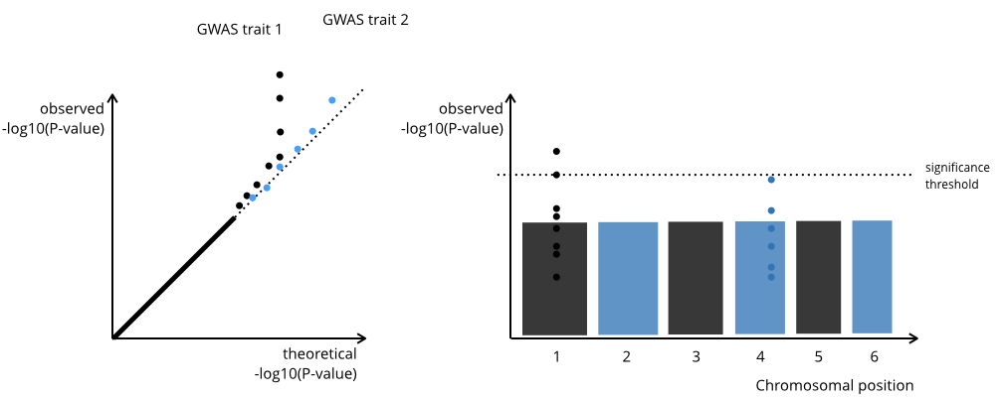

Summary
=======

Genome-wide association studies (GWAS) estimate the association between
each SNP and a trait of interest. The output of a GWAS is a matrix that
contains the information and summary statistic for each SNP per line:
`SNP identifier, chromosome, position, effect size, standard error, p-value effect allele`,
and sometimes the `minor allele frequency`.

GWAS summary statistics are often computed for 1M+ SNPs. To summarise
such large amounts of data and visualise the P-value distribution, two
plots are typically done: - A Q-Q plot displays the theoretical against
the observed p-value (McCarthy et al. 2008). A Q-Q plot helps to
identify inflated P-values due to a mispecified GWAS model. Genomic
inflation factors attempt the same. - A Manhattan plot displays the
p-values along the chromosomal position (McCarthy et al. 2008).

While the GWAS computation itself is often done with command line tools
(e.g. (**???**) or Yang et al. (2011)), the
exploration and validation of the results is done in conventional
statistical software, such as R (R Core Team 2018).

Q-Q plots might only be looked at once during the analysis process, but
a Manhattan plots become primary figure of an article. For example, a
prominent GWAS on anorexia (Watson et al. 2019) has a Manhattanplot as
Figure 1, but the Q-Q plot is in the Supplementary.

Therefore, fast plotting is key to quickly summarise results during the
analysis process and take decisions. But equally important is versatile
plotting - being able to add layers and annotation to a plot to make it
easily understandable for a reader.

`ggplot2`(Wickham 2016) offers such a versatile data visualisation
package that is widely used. However, `ggplot2` is known for its low
speed (ref). One reason for this is that a `ggplot2` object contains
multiple versions of the data being plotted.

With `ggGWAS` we propose a `ggplot2` extension for GWAS Q-Q plots
(`geom_gwas_qq`) and Manhattan plots (`geom_gwas_manhattan`). For
`geom_qqplot` there is additionally a hexagon version that reduces
computing time by xx (`geom_gwas_qq_hex`). For both functions there is a
filtering argument where points can be omitted.

Background
==========

Q-Q plots and Manhattan plots are implemented in R with various
functions. The most widely used package is `qqman` (Turner 2017), that
has a function for Q-Q plots `qq` and Manhattan plots `manhattan`, but
which is based on base R `graphics`. The `ramwas` bioconductor package
(Shabalin et al. 2018) has two fast plotting functions too `manPlotFast`
and `qqPlotFast`, also based on base R. There are many `ggplot2`
wrapper, e.g. `mkanai/ggman` (Kanai 2015), `drveera/ggman` (Rajagopal
2016), `ggbio` (Yin, Cook, and Lawrence 2012). But none of these is an
extension that inherits the ggplot2 functionalities.

How can we speed up plotting in R? Two approaches are to 1) only plot a
subset of points (called *filtering* later) or 2) use hexagons to
represent clusters of points. There is a third option, to use rastering,
but this will only affect the resulting image file size and not really
the plotting speed in R. Hexagons are actually implemented in R and have
been used to plot high dimensional data by others (Freytag 2019).

<table>
<thead>
<tr class="header">
<th></th>
<th>Obj Size</th>
<th>Plotting speed</th>
<th>File size</th>
</tr>
</thead>
<tbody>
<tr class="odd">
<td>Filtering</td>
<td>x</td>
<td>x</td>
<td>x</td>
</tr>
<tr class="even">
<td>hexagons</td>
<td></td>
<td>x</td>
<td>x</td>
</tr>
<tr class="odd">
<td>raster</td>
<td></td>
<td></td>
<td>x</td>
</tr>
</tbody>
</table>

The `ggGWAS` R package
======================

The `ggGWAS` package depends mainly on `ggplot2`, `hexbin`, `scales`.
Additionally `dplyr` and `magrittr` are used for …

Brief example
=============

Q-Q plot
--------

    ggplot(data = giant) + 
      geom_gwas_qq(aes(y = P)) + 
      geom_abline(intercept = 0, slope = 1, linetype = 2) + 
      theme(aspect.ratio = 1)

Manhattanplot
-------------

`ggplot(data = giant) + geom_gwas_manhattan(aes(pos = POS, chr = CHR, y = -log10(P)))`

-   range of chromosomes can be passed on
-   allow for the `raster` version (for faster plotting) and Pvalue
    thresholding (removing the high Pvalue SNPs from the plot)
-   implement coloring (two alternating colors)

Discussion
==========

-   even though facetting could work, this is probably not possible when
    multiple GWAS with millions of SNps are present.

-   implemented rastering, but that did not work (only dcreased file
    size)

-   speed comparison
    `qqman::manhattan(giant, chr = "CHR" , bp = "POS", p = "P")`

Acknowledgements
================

<!-------- We acknowledge contributions from Brigitta Sipocz, Syrtis Major, and Semyeong
Oh, and support from Kathryn Johnston during the genesis of this project.-------->

-   Flavia Hodel contributed parts of the Manhattan plot
-   Fellay lab

References
==========

Freytag, Saskia. 2019. *Hexbin Plots for Single Cell Omics Data*.
<https://github.com/SaskiaFreytag/schex>.

Kanai, Masahiro. 2015. *Ggman: Manhattan Plot Using Ggplot2*.
<https://github.com/mkanai/ggman>.

McCarthy, Mark I., Gonçalo R. Abecasis, Lon R. Cardon, David B.
Goldstein, Julian Little, John P. A. Ioannidis, and Joel N. Hirschhorn.
2008. “Genome-Wide Association Studies for Complex Traits: Consensus,
Uncertainty and Challenges.” *Nature Reviews Genetics* 9 (5): 356–69.
<https://doi.org/10.1038/nrg2344>.

Rajagopal, Veera M. 2016. *Ggman: R Package for Manhattan Plots*.
<https://github.com/drveera/ggman>.

R Core Team. 2018. *R: A Language and Environment for Statistical
Computing*. Vienna, Austria: R Foundation for Statistical Computing.
<https://www.R-project.org/>.

Shabalin, Andrey A, Mohammad W Hattab, Shaunna L Clark, Robin F Chan,
Gaurav Kumar, Karolina A Aberg, and Edwin JCG van den Oord. 2018.
“RaMWAS: Fast Methylome-Wide Association Study Pipeline for Enrichment
Platforms.” *Bioinformatics*.
<http://dx.doi.org/10.1093/bioinformatics/bty069>.

Turner, Stephen. 2017. *Qqman: Q-Q and Manhattan Plots for Gwas Data*.
<https://CRAN.R-project.org/package=qqman>.

Watson, Hunna J., Zeynep Yilmaz, Laura M. Thornton, Christopher Hübel,
Jonathan R. I. Coleman, Héléna A. Gaspar, Julien Bryois, et al. 2019.
“Genome-Wide Association Study Identifies Eight Risk Loci and Implicates
Metabo-Psychiatric Origins for Anorexia Nervosa.” *Nature Genetics*,
July, 1. <https://doi.org/10.1038/s41588-019-0439-2>.

Wickham, Hadley. 2016. *Ggplot2: Elegant Graphics for Data Analysis*.
Springer-Verlag New York. <https://ggplot2.tidyverse.org>.

Yang, Jian, S. Hong Lee, Michael E. Goddard, and Peter M. Visscher.
2011. “GCTA: A tool for genome-wide complex trait analysis.” *American
Journal of Human Genetics* 88 (1): 76–82.
<https://doi.org/10.1016/j.ajhg.2010.11.011>.

Yin, Tengfei, Dianne Cook, and Michael Lawrence. 2012. “Ggbio: An R
Package for Extending the Grammar of Graphics for Genomic Data.” *Genome
Biology* 13 (8): R77.
